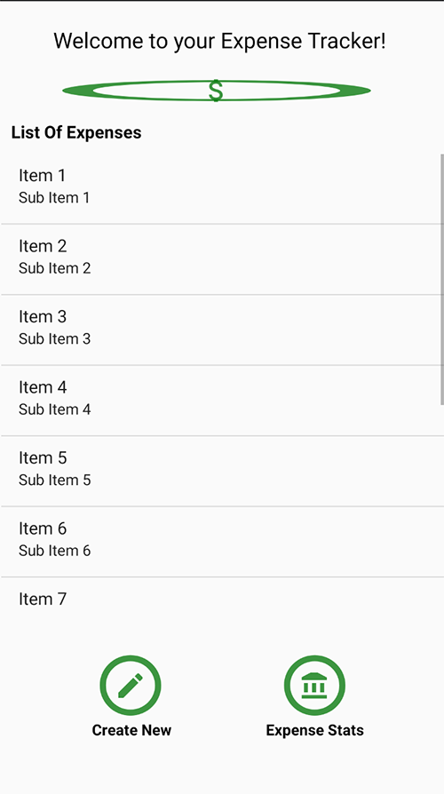

# Expense Tracker 
##### Mobile Programming Assignment

## Main Screen

## Add or Edit Expense Screen

## General info
This project was created to help the user to keep/maintain an expense list. Users are able to list the 
expense and add details such as the name, category of the expense, date of purchase, amount spent
and any other addtional notes. The application also will allow users to see their most expensive expense
and their least expensive expense.
	
## Technologies
Project is created with:

* Android Studio
* Java
